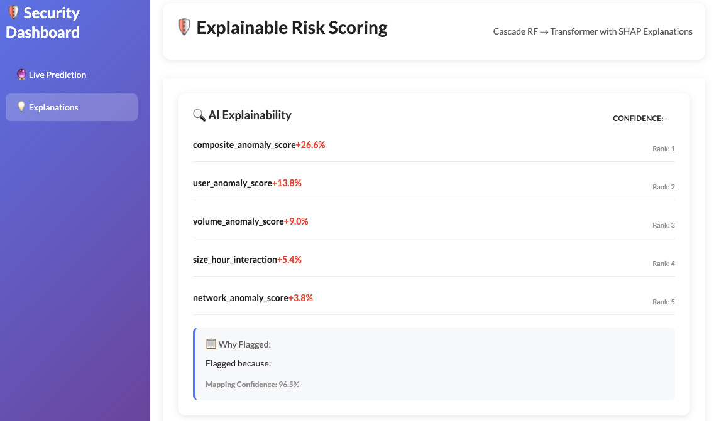
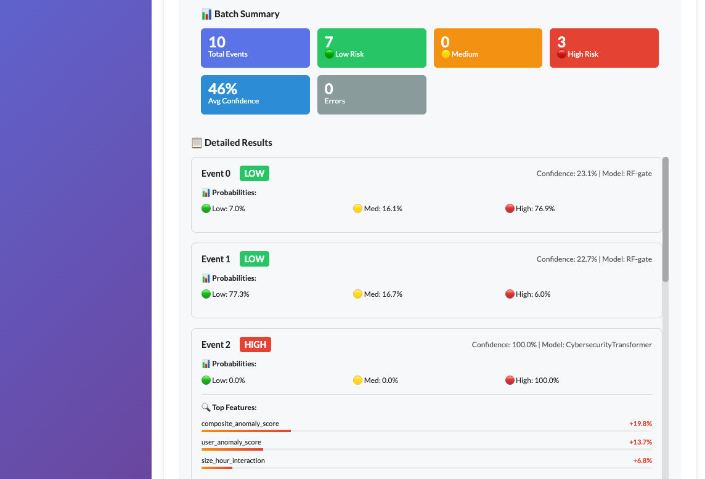

# Cross-Model Explanation Transfer for Cascade Insider Threat Detection

A two-stage cascade SIEM pipeline that pairs a **Random Forest** (fast gating) with a **Transformer** (sequence-aware escalation) and introduces **TXM (Transformer eXplanation Mapper)** — a deterministic method for transferring SHAP-based attributions across architecturally different models while preserving sign consistency, feature ranking, and probability monotonicity.

Evaluated on the [CERT r6.2 Insider Threat Dataset](https://kilthub.cmu.edu/articles/dataset/Insider_Threat_Test_Dataset/12841247/1) (Carnegie Mellon CERT Division).

---

## Architecture

<p align="center">
  
</p>

**Cascade decision rule:**

```
Stage 1 (RF Gate):    if max(P_RF) < τ   →  Benign (early exit)
Stage 2 (Transformer): if P_RF ≥ τ        →  escalate to Transformer
                        if P_Trans ≥ τ₂   →  Malicious
                        else               →  Benign
```

Both thresholds (τ, τ₂) are tuned via PR-F1 optimization on a held-out validation split. The RF gate provides early exit for ~60–80% of benign events, keeping Transformer inference for ambiguous cases only.

**TXM mapping:**

```
mapped_SHAP = RF_SHAP × α,   where α = clip(P_trans / P̂_rf, 0, 10)
```

Three fidelity metrics gate the mapping quality at serving time:

| Metric | Definition | Range |
|--------|-----------|-------|
| **Sign fidelity** | Fraction of features where `sign(RF_SHAP) == sign(mapped_SHAP)` | [0, 1] |
| **Rank fidelity** | Kendall τ over the union of top-k features from both models | [-1, 1] |
| **Probability monotonicity** | `tanh((ΔL1_attr / L1_rf) × (ΔP / P_rf))` — whether relative changes in attribution magnitude track relative changes in probability | [-1, 1] |

When sign fidelity < 0.7 or rank fidelity < 0.2, the system falls back to Captum Integrated Gradients for the Transformer explanation.

---

## Serving Interface

<p align="center">
  
  
</p>

**Endpoints:**

| Method | Path | Description |
|--------|------|-------------|
| `POST` | `/api/v1/predict` | Single event — returns risk label, confidence, model used, and TXM explanation |
| `POST` | `/api/v1/predict/batch` | Batch events (up to 10k) — returns per-event results with summary statistics |
| `POST` | `/api/v1/explain` | Detailed explanation with method selection (`shap`, `captum`, `attention`, `auto`) |
| `POST` | `/api/v1/explain/compare` | Side-by-side RF vs Transformer explanations with fidelity alignment |
| `GET`  | `/api/v1/health/health` | Health check |

---

## Models

### Random Forest (Stage 1)

- 200 estimators, class weights `{0:1, 1:6, 2:12}` to penalize minority-class misses
- Preprocessing: `StandardScaler` (continuous), `OneHotEncoder` (low-cardinality categorical), `OrdinalEncoder` (high-cardinality)
- Class balancing via **SafeSMOTE** — adapts `k_neighbors` to `min(k, max(1, min_class_count - 1))` per CV fold to prevent errors on small minority classes
- 5-fold stratified cross-validation, F1-macro scoring

### Cybersecurity Transformer (Stage 2)

- `d_model=64`, `nhead=8`, `num_layers=4`, `dim_feedforward=d_model×2` (128), GELU activation in encoder layers
- **Risk-Aware Attention**: per-timestep risk scoring via learned sigmoid gate
- **Time-Weighted Global Pooling**: softmax over temporal positions, favoring recent events
- Input: sequences of up to 50 historical events per user, constructed with **no temporal leakage** (test sequences draw only from training history)
- Classification head: `64 → 32 → 16 → 3` with ReLU and dropout (0.45, 0.3)

### Dr.GRPO Training (Optional)

Two-phase training variant with a rationale prediction head:

1. **Distillation** (50 epochs): Focal loss for classification + BCE for rationale prediction. Rationale targets extracted from RF SHAP top-k features expanded via nearest-neighbor matching.
2. **GRPO fine-tuning** (20 epochs): Policy gradient optimization targeting recall ≥ 0.8 for the high-risk class (class 2).

---

## Features

40 engineered features across four categories:

| Category | Count | Examples |
|----------|-------|---------|
| Continuous | 20 | `destination_entropy`, `upload_velocity`, `composite_anomaly_score`, `domain_switching_rate` |
| Boolean | 16 | `after_hours`, `first_time_destination`, `is_usb`, `is_large_upload` |
| Low-cardinality categorical | 3 | `channel`, `from_domain`, `primary_channel` |
| High-cardinality categorical | 1 | `destination_domain` |

Transformer inputs are formatted as temporal sequences `(N, 50, 36)` for continuous/boolean and `(N, 50, 4)` for categorical features, with leak-free construction: test sequences only reference training-time events.

---

## Reproducing Results

### Prerequisites

- Python 3.11+
- [CERT r6.2 dataset](https://kilthub.cmu.edu/articles/dataset/Insider_Threat_Test_Dataset/12841247/1) — download and extract to `r6.2/`

### Step-by-step pipeline

```bash
# 1. Install dependencies
python -m venv .venv && source .venv/bin/activate
pip install -r requirements.txt

# 2. Ingest raw data → intermediate parquet + train/test split indices
python -m src.ingest.chunk_build_uploads --input_dir r6.2 --output data_processed

# 3. Feature engineering → tabular matrix + sequence tensors
python -m src.features.make_features \
  --uploads data_processed/uploads.parquet \
  --train_ids data_processed/train_ids.npy \
  --test_ids data_processed/test_ids.npy \
  --out_dir data_processed

# 4. Train Random Forest
python -m models.train_rf --data_dir data_processed --grid 2 --n_jobs -1

# 5. Train Cybersecurity Transformer
python -m models.train_cybersecurity_transformer --data_dir data_processed --epochs 50

# 6. Tune cascade thresholds (τ, τ₂) → writes cascade_config.json
python -m models.cascade --data_dir data_processed

# 7. (Optional) Dr.GRPO distillation + fine-tuning
python -m models.improved_model_training_with_rationale_head.drgrpo_training_for_cybersecurity_transformer \
  --phase all --data_dir data_processed

# 8. Evaluate TXM fidelity
python -m src.evaluation.evaluate_txm_fidelity \
  --data_dir data_processed \
  --config config/cascade_config.json \
  --k 10 --s_min 0.7 --r_min 0.2 \
  --out data_processed/txm_fidelity_report.json
```

### Serving

```bash
# Option A: Docker
./scripts/docker-build.sh
./scripts/docker-dev.sh

# Option B: Flask directly
export CASCADE_CONFIG_PATH=config/cascade_config.json
python -m src.serving.app

# Verify
curl http://localhost:5000/api/v1/health/health
```

### Example prediction

```bash
curl -X POST http://localhost:5000/api/v1/predict \
  -H "Content-Type: application/json" \
  -d '{
    "post_burst": 5,
    "destination_entropy": 6.2,
    "hour": 23,
    "timestamp_unix": 1716203600,
    "seconds_since_previous": 5,
    "uploads_last_24h": 12,
    "user_anomaly_score": 0.6,
    "cluster_anomaly_score": 0.4,
    "temporal_anomaly_score": 0.9,
    "volume_anomaly_score": 0.8,
    "network_anomaly_score": 0.7,
    "composite_anomaly_score": 0.95,
    "destination_novelty_score": 0.85,
    "frequency_anomaly_score": 0.5,
    "decoy_risk_score": 0.6,
    "days_since_decoy": 2,
    "size_hour_interaction": 0.9,
    "entropy_burst_interaction": 0.8,
    "upload_velocity": 0.95,
    "domain_switching_rate": 0.7,
    "first_time_destination": true,
    "after_hours": true,
    "is_large_upload": true,
    "to_suspicious_domain": true,
    "is_usb": true,
    "is_weekend": true,
    "has_attachments": true,
    "is_from_user": true,
    "is_outlier_hour": true,
    "is_outlier_size": true,
    "is_rare_channel": false,
    "is_high_frequency_user": true,
    "exceeds_daily_volume_norm": true,
    "is_decoy_interaction": false,
    "weekend_afterhours_interaction": true,
    "rare_hour_flag": true,
    "destination_domain": "suspicious.net",
    "channel": "USB",
    "from_domain": "company.com",
    "primary_channel": "USB"
  }'
```

---

## Repository Structure

```
├── models/
│   ├── cascade.py                  # Cascade tuning (τ, τ₂ optimization)
│   ├── cybersecurity_transformer.py # Transformer architecture
│   ├── train_cybersecurity_transformer.py
│   ├── train_rf.py                 # Random Forest training + evaluation
│   ├── safe_smote.py               # Adaptive SMOTE wrapper
│   └── improved_model_training_with_rationale_head/
│       ├── cybersecurity_transformer.py   # Enhanced model with rationale head
│       └── drgrpo_training_for_cybersecurity_transformer.py
├── src/
│   ├── ingest/
│   │   └── chunk_build_uploads.py  # Raw data → parquet ingestion
│   ├── features/
│   │   └── make_features.py        # Feature engineering + sequence construction
│   ├── evaluation/
│   │   ├── evaluate_txm_fidelity.py
│   │   └── feature_importance_Shap_concentration_TXM_and_IG_overlap.py
│   ├── serving/
│   │   ├── app.py                  # Flask API
│   │   ├── prediction/predictions.py
│   │   ├── explanations/explanation.py
│   │   ├── models/
│   │   │   ├── cascade.py          # Serving-time cascade logic
│   │   │   ├── model_loader.py     # Model loading pipeline
│   │   │   └── encoders.py         # Feature encoding (tabular + sequence)
│   │   └── utils/
│   │       ├── cross_model_attribution_fidelity_metrics.py  # TXM fidelity
│   │       ├── feature_mapping.py  # TXM: RF→Transformer attribution transfer
│   │       ├── explanation_utils.py
│   │       ├── shap_utils.py
│   │       ├── tau_serving_decision_helper.py
│   │       └── validation.py
│   └── utils/
│       ├── business_rules.py       # Domain-specific risk rules
│       ├── ground_truth_labeling.py
│       └── dynamic_date_cutoff.py
├── image/                          # Architecture diagrams
├── scripts/                        # Docker build/run/stop scripts
├── Dockerfile
├── docker-compose.dev.yml
└── requirements.txt
```

---

## Key Dependencies

| Package | Purpose |
|---------|---------|
| `torch` ≥ 2.2 | Transformer model |
| `scikit-learn` 1.6.1 | Random Forest, preprocessing |
| `shap` ≥ 0.41 | TreeExplainer for RF attributions |
| `captum` ≥ 0.6.1 | Integrated Gradients fallback |
| `imbalanced-learn` ≥ 0.11 | SMOTENC for class balancing |
| `flask` ≥ 2.3 | Serving API |
| `pandas`, `numpy`, `pyarrow` | Data pipeline |

Full list: [requirements.txt](requirements.txt)

---

## Citation

If you use this code in your research, please cite:

```bibtex
@software{ngwu2025txm,
  author    = {Ngwu, Nnamdi},
  title     = {Cross-Model Explanation Transfer for Cascade Insider Threat Detection},
  year      = {2025},
  url       = {https://github.com/NnamdiNgwu/explainable_ML}
}
```

---

## License

This project is licensed under the MIT License — see [LICENSE](LICENSE) for details.
